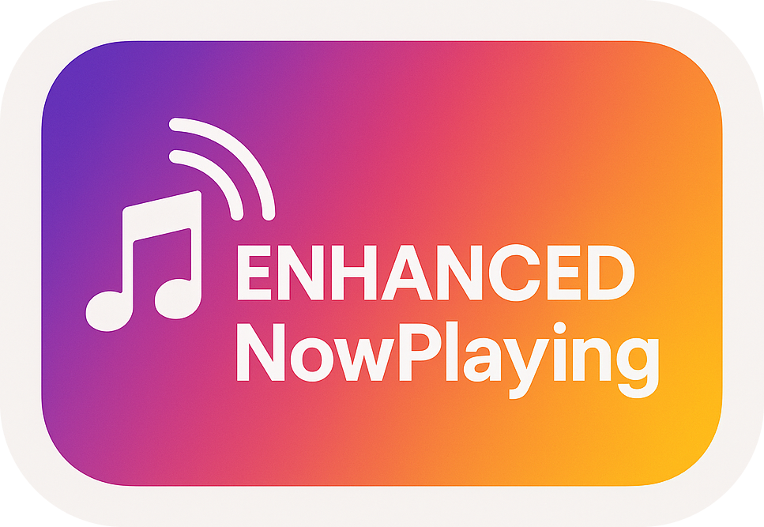

# Enhanced NowPlaying

Enhance your shared music links with beautiful OGP images.

## ✨ Features

- 🎨 **Beautiful OGP Images** - Automatically generate stunning Open Graph images for your shared music links
- 🎵 **Music Service Integration** - Currently supports YouTube Music with more platforms coming soon
- 🔗 **One-Click Sharing** - Simply click the "Now Playing" button to share your current track

## 📦 Installation

Download extension zip file from [Releases](https://github.com/mimifuwa/enhanced-nowplaying/releases).

Unzip donwloaded file, and load extension on your browser (You might need to enable "Developer mode").

## 🚀 Usage

Just push "Now Playing" button on your music player (Currently, only YouTube Music is supported).

## 🐛 Bug report

[Issue](https://github.com/mimifuwa/enhanced-nowplaying/issues) or DM ([@mimifuwa](https://x.com/mimifuwa_dev/)).

## 🤝 Contributing

now preparing...

## 📃 License

[GPL-3.0 license](https://github.com/mimifuwa/enhanced-nowplaying/LICENSE)
